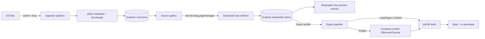
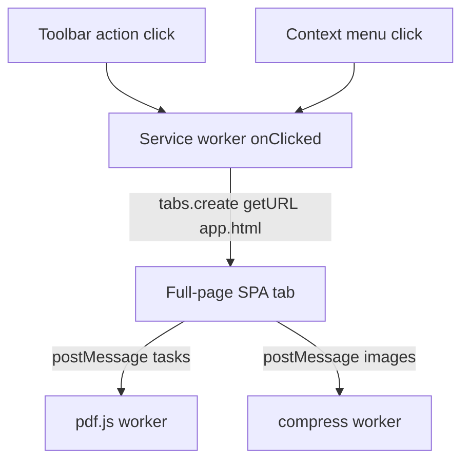

# PDF Manager Chrome Extension - Architecture & Implementation Plan

Status: v1.0 - Draft for approval
Manifest: V3 only
Privacy stance: 100% client-side. No file content ever leaves the browser.

---

## 1. Executive Summary

A Manifest V3 Chrome Extension that is, in practice, a full client-side web app for working with
PDFs. It has two panes:

1. **Source / Resources** - load PDFs, images (PNG/JPG/etc.), and plain text files; preview pages as
   thumbnails plus a larger preview; show metadata (page count, page dimensions, file size, title/author).
   Loading via file picker AND drag-and-drop.
2. **Result / Destination PDF** - assemble a brand-new PDF by dragging single or multiple pages from
   source PDFs and images into a destination canvas, in any order; live preview of the destination; export
   with three profiles: compressed, optimized for web sharing, optimized for printing.

All parsing, rendering, assembly, and export happen client-side in the browser using `pdf.js` (render)
and `pdf-lib` (assemble/export). The extension requests **no host permissions** and **no network access**.

---

## 2. The Central Question: How to present a full web app launched from an extension

### Options compared

| Option | Screen real estate | State persistence | DnD across two panes | MV3 / CSP fit | Offline | Store review | Verdict |
|---|---|---|---|---|---|---|---|
| **Popup** | Tiny (max ~800x600, collapses on blur) | Lost on close | Cramped, two-pane DnD impractical | OK | Yes | Easy | Reject - too small, dies on focus loss |
| **Side Panel API** | Narrow vertical strip (~300-500px wide), user-resizable but width-bound | Persists across tab nav | Two side-by-side panes do not fit a narrow strip | Good | Yes | Easy | Reject for this app - geometry wrong for dual-pane DnD |
| **New Tab override** | Full page | Per-tab | Great | Good | Yes | Hostile - hijacks every new tab, high user friction and review scrutiny | Reject - wrong UX contract |
| **Externally hosted web app (extension just bookmarks/launches it)** | Full page | Full | Great | N/A (it is a website) | No (needs network) | Easy but pointless | Reject - breaks the privacy promise and offline goal; the extension adds nothing |
| **Full-page extension page in a new tab (`chrome-extension://.../app.html` SPA)** | Full page, full width | Per-tab, fully controllable | Ideal - two resizable panes, native HTML5 DnD | Excellent - packaged page under extension CSP | Yes - fully offline | Easy - standard pattern | **RECOMMENDED** |

### Recommendation: Action button opens a full-page extension page (SPA) in a new tab

The toolbar action has no popup. Clicking it (or a context-menu/keyboard-shortcut) calls
`chrome.tabs.create({ url: chrome.runtime.getURL('app.html') })`, opening the SPA in a normal tab at
`chrome-extension://<id>/app.html`.

**Why this wins for this product:**

- **Real estate for dual-pane DnD.** The core interaction is dragging pages between two side-by-side
  galleries. That needs a wide, full-height surface. The Side Panel is a narrow vertical strip and the
  popup is tiny and dismisses on blur. Chrome's own guidance frames the Side Panel as the place for UI
  that is *common to all sites and persists alongside browsing* - not a workspace app. ([Side Panel launch
  blog](https://developer.chrome.com/blog/extension-side-panel-launch), [Side Panel API
  reference](https://developer.chrome.com/docs/extensions/reference/api/sidePanel))
- **State & persistence.** A full tab is a long-lived document context. The popup loses all in-memory
  state the instant it loses focus, which is fatal when the user has loaded large PDFs into memory.
- **MV3 / CSP fit.** A packaged extension page runs under the strict, predictable extension CSP
  (`script-src 'self' 'wasm-unsafe-eval'`) - everything is bundled, nothing remote.
  ([CSP reference](https://developer.chrome.com/docs/extensions/reference/manifest/content-security-policy))
- **Offline & privacy.** Hosting the app inside the package (vs. an external website) means it works
  with the browser offline and no file ever needs a network round-trip. An "extension that just opens a
  website" would defeat both the privacy promise and offline use.
- **Store review.** Opening a full-page extension page on action click is a long-established, low-friction
  pattern. New Tab override is heavily scrutinized and user-hostile; we avoid it.

**Optional enhancement (post-v1):** also register a Side Panel that hosts a *compact companion* (e.g. a
"send current tab's PDF to the workspace" launcher), but the main workspace stays the full tab. Not in v1.

---

## 3. Tech Stack

| Concern | Choice | Notes |
|---|---|---|
| Language | **TypeScript** (strict) | Typed message/state contracts |
| UI | **React 18** | Mature DnD ecosystem, component model |
| Build | **Vite** + `@crxjs/vite-plugin` (or hand-rolled MV3 config) | Fast HMR; handles manifest + worker bundling. Validate crxjs MV3 support at build time; fall back to manual Rollup MV3 config if needed |
| Styling | **Tailwind CSS** | Fast, consistent; scoped to the app page (not injected into host pages, so no leakage concern) |
| State | **Zustand** | Tiny, no boilerplate, holds resource/destination model + object URLs. Avoid Redux overhead for a single-page workspace |
| PDF render/preview | **pdf.js (`pdfjs-dist`)** | Page rasterization to `<canvas>` for thumbnails + large preview; metadata extraction |
| PDF assembly/export | **pdf-lib** | Copy pages across PDFs, embed images, build new document, write bytes |
| Image compression | **Canvas API** (offscreen `OffscreenCanvas` in a worker) | Re-encode/downsample images BEFORE embedding - this is the pdf-lib workaround (see 3.2) |
| DnD | **@dnd-kit/core** | Accessible, pointer + keyboard DnD, sortable lists; better a11y than react-dnd |
| Tests | **Vitest** (unit) + **Playwright** (E2E loading the unpacked extension) | |

### 3.1 PDF libraries - division of labor

- **pdf.js** = *read & render*. Open a PDF, read metadata (`getMetadata()` -> Title/Author/etc.,
  `numPages`, per-page `getViewport()` for dimensions), and rasterize pages to canvases for thumbnails and
  the large preview. pdf.js does NOT build/edit PDFs.
- **pdf-lib** = *write & assemble*. `PDFDocument.create()`, `copyPages()` to pull selected pages from source
  PDFs into the destination, `embedJpg`/`embedPng` + `drawImage` for image resources, then `save()` to
  produce the export bytes. pdf-lib does NOT rasterize/preview for you.

These are complementary - the standard client-side combo. ([pdf-lib](https://github.com/Hopding/pdf-lib),
[pdf.js](https://github.com/mozilla/pdf.js))

### 3.2 The three export profiles + the pdf-lib compression limitation

**Key limitation:** `pdf-lib` does **not** re-compress or downsample images on its own. It embeds image
bytes roughly as given and the only document-level lever it exposes is object-stream compression
(`save({ useObjectStreams: true })`), which helps structure but not raster payload. Confirmed by the
maintainers/community. ([pdf-lib compression issue #1657](https://github.com/Hopding/pdf-lib/issues/1657))

**Workaround (the real strategy):** do image compression **before** embedding, using the Canvas API to
downsample resolution and re-encode quality, then hand the resulting bytes to pdf-lib. Pages copied from
existing source PDFs cannot be transparently recompressed by pdf-lib; for those, the high-fidelity path is
"keep as-is", and the aggressive path is "rasterize the page via pdf.js to a canvas at a target DPI, re-encode
as JPEG, embed that image as a full-page image" - trading vector fidelity for size. This trade-off is exactly
what distinguishes the three profiles. (General client-side PDF optimization techniques:
[DEV: Advanced PDF Optimization](https://dev.to/revisepdf/advanced-pdf-optimization-techniques-1752741-5b7j))

| Profile | Image target | Page-copy fidelity | Mechanism |
|---|---|---|---|
| **Optimized for printing** (highest quality) | Downsample to ~300 DPI cap, JPEG q~0.92 / keep PNG when lossless needed | Copy pages as native vector via `copyPages` (no rasterization) | pdf-lib `copyPages` + Canvas pre-encode for new images only; `useObjectStreams: true` |
| **Optimized for web sharing** (balanced) | Downsample to ~150 DPI cap, JPEG q~0.8 | Copy pages native; recompress only embedded images | Same as above with tighter Canvas params |
| **Compressed** (smallest) | Downsample to ~96-120 DPI cap, JPEG q~0.6 | Optionally rasterize copied pages via pdf.js -> JPEG -> embed (flatten) for max size reduction (user-warned: text becomes image) | pdf.js raster -> Canvas re-encode -> pdf-lib embed; `useObjectStreams: true` |

Compression is performed in an **OffscreenCanvas inside a Web Worker** to avoid blocking the UI thread.

---

## 4. MV3 Manifest Design

```jsonc
{
  "manifest_version": 3,
  "name": "PDF Manager",
  "version": "1.0.0",
  "description": "Assemble, preview, and export PDFs entirely in your browser. Files never leave your device.",
  "action": {
    "default_title": "Open PDF Manager"
    // NOTE: intentionally no default_popup -> action click handled by service worker
  },
  "background": {
    "service_worker": "background.js",
    "type": "module"
  },
  "permissions": [
    "contextMenus"
  ],
  "optional_permissions": [],
  "host_permissions": [],
  "content_security_policy": {
    "extension_pages": "script-src 'self' 'wasm-unsafe-eval'; object-src 'self'; worker-src 'self'"
  },
  "web_accessible_resources": [],
  "icons": { "16": "icons/16.png", "48": "icons/48.png", "128": "icons/128.png" },
  "minimum_chrome_version": "116"
}
```

### 4.1 Permission justification (least privilege)

| Permission | Requested? | Justification |
|---|---|---|
| `host_permissions` | **None** | The app never touches web page content or remote servers. This is the single biggest review and trust win. |
| `<all_urls>` / `activeTab` | **No** | No content scripts, no page reading. Files come from the OS file picker / drag-drop, not from web pages. |
| `tabs` | **No** | `chrome.tabs.create` to open our own packaged page does **not** require the `tabs` permission. |
| `contextMenus` | **Yes** | Optional convenience: right-click -> "Open PDF Manager". If dropped, action click alone suffices. Keep only if used. |
| `storage` | **No (v1)** | v1 keeps everything in tab memory. Add `storage` only if we later persist UI prefs (export profile default). When added, justify as "remember last export profile". |
| `sidePanel` | **No (v1)** | Not used in v1. |
| `downloads` | **No** | Export uses an `<a download>` blob link from the page; no `downloads` permission needed. |
| `wasm-unsafe-eval` (CSP) | **Yes** | Allows WebAssembly. pdf.js can use a WASM path; declaring it future-proofs the CSP. Pure-JS fallback also works. |

### 4.2 CSP and the pdf.js worker under MV3

MV3 enforces, at minimum: `script-src 'self' 'wasm-unsafe-eval'; object-src 'self'`. You **cannot** load
remote scripts and **cannot** spawn workers from `data:`/`blob:` URIs as arbitrary code - the worker must be
a **packaged file**. ([CSP reference](https://developer.chrome.com/docs/extensions/reference/manifest/content-security-policy),
[chromium-extensions: no data-URI workers](https://groups.google.com/a/chromium.org/g/chromium-extensions/c/nQp-Dtc7q6k))

**How we bundle the worker:**

- Import the worker as a packaged URL at build time (Vite): `import workerUrl from 'pdfjs-dist/build/pdf.worker.min.mjs?url'` and set `pdfjsLib.GlobalWorkerOptions.workerSrc = workerUrl;` **in the same module** that first uses pdf.js (module execution order matters, or the default overwrites your value).
  ([pdf.js Vite worker discussion #19520](https://github.com/mozilla/pdf.js/discussions/19520),
  [react-pdf #1148](https://github.com/wojtekmaj/react-pdf/issues/1148))
- The bundled worker ends up as a `self`-hosted file inside the package, satisfying `worker-src 'self'`.
  Because the worker is referenced from our own extension page (not injected into a host page), it does NOT
  need to be listed in `web_accessible_resources` - that array is for resources accessed by web pages /
  content scripts, which we have none of. Hence `web_accessible_resources: []`.
- Pin `pdfjs-dist` to a version whose worker Vite can resolve; if v4+ resolution is flaky, use the
  `legacy/build` worker path. Add a smoke test that asserts the worker file exists in `dist/`.

---

## 5. High-Level Architecture

```
chrome-extension://<id>/
  app.html  ........ the SPA workspace (full tab)
  background.js .... service worker: action.onClicked + contextMenus only (no PDF logic)
  pdf.worker.js .... pdf.js render worker (packaged)
  compress.worker.js  OffscreenCanvas image (re)compression worker (packaged)
```

### 5.1 Component responsibilities

- **Service worker (`background.js`)** - deliberately thin. Handles `chrome.action.onClicked` ->
  `chrome.tabs.create({ url: getURL('app.html') })`, and registers a `contextMenus` item that does the same.
  **No PDF processing** happens here (service workers are ephemeral and unsuitable for holding large file
  buffers or long CPU work). All heavy lifting lives in the SPA tab.
- **App SPA (`app.html` + React)** - the entire product. Owns the in-memory model, both galleries, DnD,
  preview canvases, and export. Long-lived tab context = safe place for big `ArrayBuffer`s.
- **pdf.js worker** - off-main-thread PDF parsing/rasterization for thumbnails + preview.
- **compression worker** - off-main-thread `OffscreenCanvas` downsample/re-encode for export profiles.

### 5.2 Where files live in memory

- On load, each file is read into an `ArrayBuffer` (file picker `File` or DnD `DataTransferItem`).
- Resource model in Zustand store holds metadata + a handle to the bytes. Source PDFs are kept as parsed
  pdf.js `PDFDocumentProxy` (for rendering) and the raw bytes (for pdf-lib `copyPages` at export).
- Thumbnails are rendered to canvases and cached as `blob:` object URLs; **revoke** URLs when a resource is
  removed to avoid leaks.
- Nothing is written to `chrome.storage` or disk in v1 - closing the tab clears everything (explicit,
  privacy-friendly default).

### 5.3 Drag-and-drop data flow (two layers)

1. **File ingestion DnD (OS -> Source pane):** HTML5 drop on the source dropzone reads `dataTransfer.files`,
   reuses the same ingestion pipeline as the file picker.
2. **Page assembly DnD (Source pane -> Destination pane):** @dnd-kit. Each draggable carries a typed
   payload `{ resourceId, kind: 'pdf-page'|'image', pageIndex? }`. Multi-select drag carries an array.
   Dropping into the destination appends ordered `DestinationItem`s. The destination list is itself sortable
   (reorder, remove). Export reads this ordered list.





---

## 6. Project Structure

```
chrome.extension.manage.pdfs/
  manifest.json
  package.json
  tsconfig.json
  vite.config.ts
  tailwind.config.ts
  docs/
    architecture.md            (this file)
  public/
    icons/ (16,48,128)
  src/
    background/
      service-worker.ts        action.onClicked + contextMenus -> open app tab
    app/
      app.html
      main.tsx                 React root; sets pdfjs workerSrc here (order matters)
      App.tsx                  two-pane layout
    features/
      source/
        SourcePane.tsx
        Dropzone.tsx           file picker + DnD ingestion
        ResourceCard.tsx       thumbnail + metadata
        PreviewModal.tsx       larger preview
      destination/
        DestinationPane.tsx    sortable ordered list
        DestinationPreview.tsx live assembled preview
        ExportBar.tsx          profile selector + export button
    pdf/
      render.ts                pdf.js: open, metadata, rasterize page
      assemble.ts              pdf-lib: create, copyPages, embed, save
      compress.ts              profile presets + canvas re-encode dispatch
      profiles.ts              the 3 export profile param tables
    workers/
      pdf.worker.ts            (or use pdfjs-dist prebuilt worker via ?url)
      compress.worker.ts       OffscreenCanvas downsample/encode
    state/
      store.ts                 Zustand: resources[], destinationItems[]
      types.ts                 Resource, DestinationItem, ExportProfile, message contracts
    shared/
      objectUrl.ts             create/revoke tracking to prevent leaks
      validate.ts              file-type/size guards
  tests/
    unit/                      Vitest
    e2e/                       Playwright (load unpacked, drag, export)
```

---

## 7. Phased Implementation Plan

Each phase is executable by `chrome-extension-developer`, then validated by `chrome-extension-qa-tester`.

### Phase 0 - Foundation
- [ ] `git init`; add `.gitignore` (node_modules, dist)
- [ ] Scaffold Vite + React + TS + Tailwind; pnpm
- [ ] Add MV3 `manifest.json` per section 4; build produces loadable `dist/`
- [ ] Service worker opens `app.html` in a new tab on action click + context menu
- [ ] Lint (ESLint), format (Prettier), Vitest, Playwright skeleton; CI scaffold
- [ ] **QA gate:** unpacked extension loads with zero permission warnings beyond `contextMenus`; action opens full tab

### Phase 1 - Source pane (ingestion + preview)
- [ ] Dropzone: file picker AND drag-drop; type/size validation (PDF, PNG/JPG/WebP/GIF, txt)
- [ ] Wire pdf.js with packaged `workerSrc` (verify worker file in `dist/`)
- [ ] Extract metadata (pages, dimensions, size, title/author) and render thumbnails off-main-thread
- [ ] Resource cards + larger preview modal; image and text resources rendered too
- [ ] Object-URL lifecycle (revoke on remove)
- [ ] **QA gate:** load multi-page PDF + images + txt; metadata correct; no memory leak over repeated load/remove

### Phase 2 - Destination assembly + live preview
- [ ] @dnd-kit drag of single AND multiple pages/images from source into destination
- [ ] Ordered, sortable destination list (reorder, remove, duplicate)
- [ ] Live assembled preview
- [ ] **QA gate:** arbitrary ordering preserved; multi-select drag works; keyboard DnD works

### Phase 3 - Export + profiles
- [ ] pdf-lib assemble: `copyPages` for PDF pages, embed for images, in destination order
- [ ] compression worker (OffscreenCanvas) for the 3 profiles per section 3.2
- [ ] `useObjectStreams: true`; download via blob `<a download>`
- [ ] Profile UX with size/quality explanation; warn when "Compressed" rasterizes text
- [ ] **QA gate:** all 3 profiles produce valid PDFs; size ordering compressed < web < print; output opens in Acrobat/Preview/Chrome

### Phase 4 - Hardening, a11y, polish, release
- [ ] Empty/loading/success/error states; large-file progress + cancel
- [ ] Keyboard nav, focus management, ARIA on galleries and DnD; contrast check
- [ ] Memory guardrails (section 9); big-file E2E
- [ ] Threat-model review; dependency + license audit; no remote code
- [ ] Store listing assets, privacy disclosure ("no data collected"), screenshots
- [ ] **QA gate:** full regression + manual QA matrix; release checklist signed off

---

## 8. Testing Checklist

- [ ] Unit: metadata parsing, profile param math, ingestion validation, object-URL revoke
- [ ] Unit: assemble ordering given a destination list
- [ ] E2E (Playwright, unpacked): picker load, DnD load, source->dest drag, reorder, export each profile, verify downloaded bytes parse
- [ ] Performance: 200-page PDF + 50 images; thumbnail render time; memory ceiling
- [ ] A11y: keyboard-only assembly + export; screen-reader labels
- [ ] CSP: confirm worker loads under extension CSP; no console CSP violations
- [ ] Negative: corrupt PDF, huge file, unsupported type -> graceful error

## 9. Risks & Mitigations

| Risk | Mitigation |
|---|---|
| **Large-file memory blowup** (multiple big PDFs as ArrayBuffers + canvases) | Render thumbnails at low DPI; release `PDFPageProxy` after raster; cap concurrent renders; revoke object URLs; warn + soft-limit total loaded bytes; consider lazy page rendering (virtualized gallery) |
| **pdf.js worker/CSP failure** | Bundle worker as packaged `?url`; set `workerSrc` in entry module before first use; smoke test that `dist/` contains the worker; `worker-src 'self'` in CSP ([#19520](https://github.com/mozilla/pdf.js/discussions/19520)) |
| **pdf-lib cannot recompress images** | Pre-process via Canvas/OffscreenCanvas before embed; for "Compressed", optionally rasterize copied pages; document the fidelity trade-off ([#1657](https://github.com/Hopding/pdf-lib/issues/1657)) |
| **Thumbnail render jank** | Off-main-thread render; debounce; virtualize long galleries; progressive (placeholder -> sharp) |
| **Store review pitfalls** | No host permissions, no remote code, no content scripts; clear "no data collected" privacy disclosure; avoid New Tab override; justify `contextMenus` or drop it |
| **Service worker ephemerality** | Keep SW trivial (open tab only); never store file buffers or run PDF work in SW |
| **crxjs/Vite MV3 quirks** | Validate plugin against current MV3 at Phase 0; fallback to manual Rollup MV3 config; pin pdfjs-dist version |

## 10. Definition of Done

Architecture approved; MV3 manifest with least-privilege permissions (no host permissions) builds and loads;
both panes functional with picker + DnD; assembly with arbitrary multi-page/image ordering; all three export
profiles produce valid PDFs with expected size ordering; off-main-thread render + compress; a11y and error
states handled; unit + E2E green; no CSP violations; dependency/license audit clean; store assets + "no data
collected" disclosure ready.

---

## Sources

- [Side Panel API reference](https://developer.chrome.com/docs/extensions/reference/api/sidePanel)
- [Design a superior UX with the Side Panel API](https://developer.chrome.com/blog/extension-side-panel-launch)
- [MV3 Content Security Policy reference](https://developer.chrome.com/docs/extensions/reference/manifest/content-security-policy)
- [What's new in Chrome extensions (MV2 phase-out)](https://developer.chrome.com/docs/extensions/whats-new)
- [chromium-extensions: no Worker from data: URI under CSP](https://groups.google.com/a/chromium.org/g/chromium-extensions/c/nQp-Dtc7q6k)
- [pdf.js Vite worker resolution discussion #19520](https://github.com/mozilla/pdf.js/discussions/19520)
- [react-pdf Vite worker issue #1148](https://github.com/wojtekmaj/react-pdf/issues/1148)
- [pdf-lib image compression limitation #1657](https://github.com/Hopding/pdf-lib/issues/1657)
- [DEV: Advanced PDF Optimization Techniques](https://dev.to/revisepdf/advanced-pdf-optimization-techniques-1752741-5b7j)
- [pdf-lib](https://github.com/Hopding/pdf-lib) / [pdf.js](https://github.com/mozilla/pdf.js)
