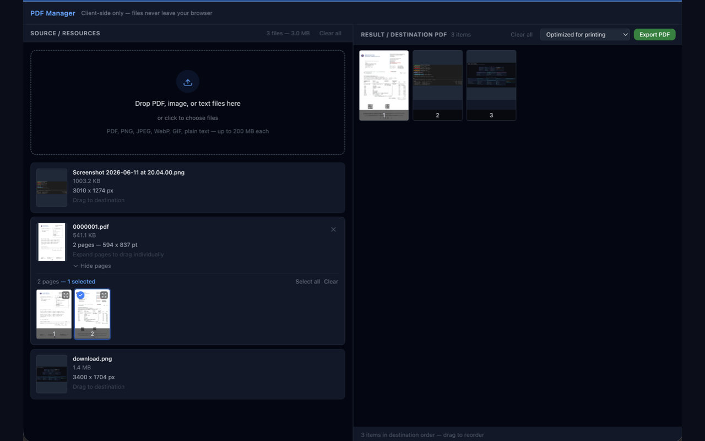

# User Guide — PDF Manager

PDF Manager is a full client-side workspace for building PDFs. You load PDFs,
images, and text, drag the pages you want into any order, preview the result
live, and export a brand-new PDF — all **inside your browser**. Nothing is ever
uploaded; the extension has no network access and no access to the pages you
visit.

This guide walks through opening the workspace, loading files, assembling a
document, choosing an export quality, and exporting.

---

## 1. Open the workspace

PDF Manager opens as a **full-page workspace**, not a small popup.

- Click the **PDF Manager** toolbar icon, **or**
- Right-click anywhere on a page and choose **Open PDF Manager** from the
  context menu.

Either action opens the workspace in a new tab. The header reads
**"Client-side only — files never leave your browser."**

The screen is split into two panes:

| Pane | Title | What it holds |
|------|-------|---------------|
| Left | **Source / Resources** | Files you have loaded |
| Right | **Result / Destination PDF** | The document you are assembling |

---

## 2. Load your files (Source pane)

Add files in either way:

- **Drag and drop** them onto the dropzone at the top of the left pane, or
- **Click the dropzone** to open the file picker.

You can load several files at once, and keep adding more at any time.

**Supported file types**

- **PDF** — `application/pdf`
- **Images** — PNG, JPEG, WebP, GIF
- **Plain text** — `.txt`

**Limits**

- Up to **200 MB** per file.
- Up to **500 MB** loaded in total.

Anything else is rejected with a short red message that auto-dismisses; the rest
of the batch keeps loading.

### What each loaded file shows

Every file becomes a **resource card** in the left pane with a thumbnail and
metadata:

- **PDFs** — page count, the first page's dimensions (in points), and the title
  / author if the PDF has them.
- **Images** — pixel dimensions.
- **Text** — marked "Plain text".

Click a card's thumbnail to open a larger **preview** (lightbox). For a
multi-page PDF, click **Show pages** to expand a grid of every page; click any
page tile to preview it full-size.

The pane header shows the running file count and total size, with a **Clear all**
link to empty the source list.

---

## 3. Assemble the destination PDF

You build the output by dragging items from the **Source** pane into the
**Result / Destination PDF** pane on the right.

### Drag in what you need

- **An image or text file** — drag its card straight into the right pane.
- **A single-page PDF** — drag its card into the right pane.
- **One page of a multi-page PDF** — click **Show pages**, then drag the page
  tile you want.
- **Several PDF pages at once** — in the expanded page grid, **multi-select**
  first (Ctrl/Cmd-click for individual pages, Shift-click for a range), then
  drag any selected tile to drop the whole selection together.

While dragging, a small badge follows the cursor showing what you're moving
(for example "3 pages"). The destination pane highlights when you're hovering
over a valid drop area.

### Arrange the order

Each item in the destination pane carries a **position number**. To rearrange,
**drag a tile** to a new spot — the rest reflow around it. The status bar at the
bottom shows the item count and reminds you that you can drag to reorder.

Hover over any destination tile for two quick actions:

- **Duplicate** — add another copy of that item.
- **Remove** — take that item out.

**Clear all** in the pane header empties the destination and starts over. The
source pane is untouched, so you can re-assemble freely.

---

## 4. Choose an export quality

Above the export button is a quality dropdown with three profiles. They trade
file size against fidelity:

| Profile (dropdown label) | Best for | What it does |
|--------------------------|----------|--------------|
| **Optimized for printing** | Archival / printing | Highest quality. Copies PDF pages as-is (vector text stays sharp); only light image downsampling (~300 DPI). Largest file. |
| **Optimized for web sharing** | Email / web | Balanced. Moderate image downsampling (~150 DPI). Vector text preserved. |
| **Compressed** | Smallest file | Most aggressive. Heavy image downsampling (~96 DPI). |

> **Note on the Compressed profile:** it **rasterizes PDF pages** — each page
> becomes an image, so selectable/searchable text becomes a picture of text. The
> status bar warns you of this while Compressed is selected. Use **Optimized for
> printing** or **Optimized for web sharing** if you need the text to stay
> selectable.

---

## 5. Export

Click **Export PDF**. The button shows progress as a percentage while the
document is assembled, and the status bar reads "Assembling PDF…". When it
finishes, your browser downloads the result as **`result.pdf`**.

If anything goes wrong, the status bar shows a red "Export failed" message
instead of downloading.

That's it — open the downloaded `result.pdf` to confirm the pages and order.

---

## 6. Tips

- **Nothing leaves your browser.** All reading, rendering, assembly, and export
  happen locally. Closing the tab clears everything from memory.
- **Keep the text selectable.** Use **Optimized for printing** or **Optimized
  for web sharing** — only **Compressed** flattens pages to images.
- **Re-use the same pages.** The source pane stays loaded after an export, and
  **Duplicate** lets you repeat a page (handy for separators or covers).
- **Big jobs.** You can load up to 500 MB total; very large PDFs render their
  page thumbnails lazily, so expanding **Show pages** may take a moment.
- **Multi-select.** Ctrl/Cmd-click picks individual pages; Shift-click picks a
  range. Drag any one selected tile to move the whole selection.

---

## More

- [Privacy policy](../PRIVACY.md) — what the extension does and does not do with
  your data.
- [Publishing checklist](PUBLISHING.md) — how the extension is packaged and
  submitted to the Chrome Web Store.
- [Architecture](architecture.md) — the design, permission/CSP rationale, and
  export-profile strategy.
- [Source code](https://github.com/lucianhanga/chrome.extension.manage.pdfs)
